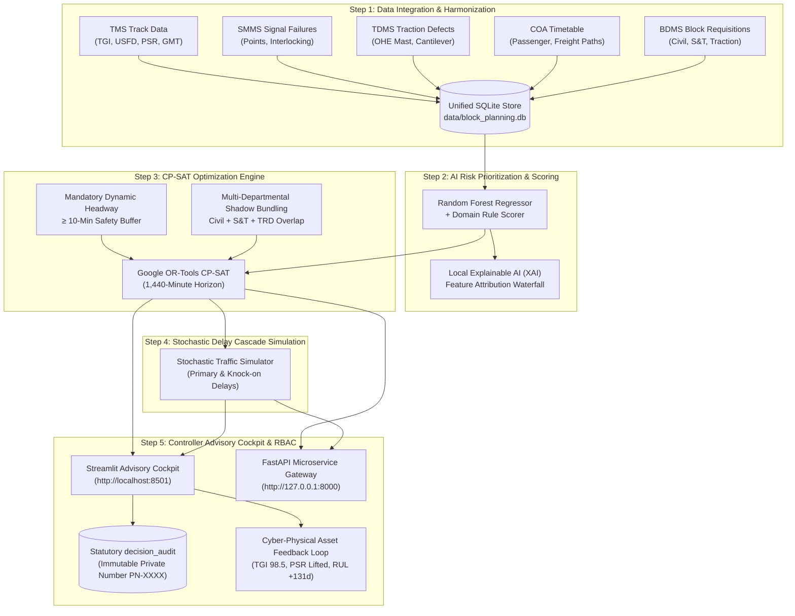

# RailFlow — Indian Railways AI-Assisted Block Planning Decision Cockpit (SIH26027)

[](https://www.python.org/downloads/)
[](https://developers.google.com/optimization)
[](https://streamlit.io/)
[](https://www.docker.com/)
[]()

> **Human-in-the-Loop Operational Framing:**  
> **AI-assisted decision support for block sanctioning** — it detects multi-departmental conflicts, ranks urgency, and proposes a mathematically optimized schedule in seconds instead of hours. The Section Controller still clicks **"Approve"**.

RailFlow is an enterprise-grade corridor scheduling and decision-support platform engineered for Indian Railways Section Controllers, Divisional Operating Managers (DOM), and Permanent Way Engineers. The system automatically detects colliding maintenance requests across **Civil Engineering (Track)**, **Signal & Telecommunication (S&T)**, and **Electrical Traction (TRD)**, evaluates timetable movements from the Control Office Application (COA), and shadow-bundles track closures into conflict-free windows using constraint programming (Google OR-Tools CP-SAT).

---

## 1. High-Level 5-Step Pipeline Architecture



---

## 2. Strict Data Provenance & Safety Compliance

> [!IMPORTANT]
> **Data Provenance Disclosure:**
> This repository operates **strictly on high-fidelity simulated synthetic telemetry** structured to match the official relational schemas of Indian Railways systems:
> - **TMS** (Track Management System): Rail fractures, weld failures, TGI index, ultrasonic flaw detection (USFD), and speed restrictions (PSR).
> - **SMMS** (Signal Maintenance Management System): Point machine failures, signal lamp failures, and track circuit drops.
> - **TDMS** (Traction Distribution Management System): OHE mast lean, contact wire wear, and neutral section defects.
> - **COA** (Control Office Application): Passenger master timetables, scheduled arrivals/departures, and fluctuating freight paths.
> - **BDMS** (Block Demand and Management System): Requisitions, machinery demands, and supervisor work windows.
>
> **No unauthorized, classified, or confidential real-world Indian Railways operational data is contained herein.** The data layer and database schemas have been standardized to official Railway Board specifications so that the pipeline can seamlessly interface with live CRIS APIs, FOIS feeds, and enterprise data lakes when officially commissioned.

### Statutory Regulatory Alignment (Indian Railways G&SR)
- **No Autonomous Line Closures**: In compliance with General & Subsidiary Rules (G&SR), the AI algorithm acts exclusively as a decision-support advisory system. Authority to block a line remains anchored with the human Section Controller.
- **Statutory Private Number Issuance**: Every block sanction triggers an official **Private Number (`PN-XXXX`)** and commits an immutable record into the `decision_audit` table.
- **10-Minute Clear Headway Enforcement**: The CP-SAT solver strictly guarantees that every maintenance block maintains a dynamic temporal separation $\ge 10$ minutes from all passenger and freight train paths.

---

## 3. Microservices Architecture & Directory Tree

The system is decoupled into isolated, single-responsibility micro-engines with explicit Python routing:

```
sih/
├── solver/                      # Optimization & Scheduling Micro-Engine
│   ├── __init__.py              # Package routing & public API
│   ├── block_solver.py          # Google OR-Tools CP-SAT bundling solver (1,440m horizon, 10m buffer)
│   ├── pareto_solver.py         # Bi-objective Pareto frontier optimizer (D'Ariano et al.)
│   ├── baseline.py              # Procedural Naive Sequential FIFO manual baseline generator
│   ├── distributed_decomposer.py# Regional distributed decomposition for zone-scale scale (Lippes)
│   └── resource_leveling.py     # Heavy machinery & crew leveling constraints (Budai-Balke / Pour)
│
├── ml_risk_engine/              # Machine Learning & Asset Health Micro-Engine
│   ├── __init__.py              # Package routing & public API
│   ├── prioritization_engine.py # Dual-scoring AI prioritization (Rules + Random Forest + Local XAI)
│   └── asset_feedback.py        # Cyber-physical asset feedback loop & Weibull RUL trajectory
│
├── simulator/                   # Stochastic Simulation Micro-Engine
│   ├── __init__.py              # Package routing & public API
│   └── traffic_simulator.py     # Downstream delay cascade propagation & headway breach auditor
│
├── cockpit/                     # Human-in-the-Loop Advisory Cockpit
│   ├── __init__.py              # Cockpit module entry
│   └── app.py                   # Streamlit advisory cockpit with RBAC, Plotly Gantt & Heatmaps
│
├── backend/                     # High-Performance API Gateway & Core Persistence Layer
│   ├── __init__.py              # Unified backward-compatible routing gateway
│   ├── api.py                   # 15 REST endpoints (FastAPI + Uvicorn)
│   ├── database_schema.py       # SQLAlchemy ORM models & SQLite engine
│   ├── mock_data_generator.py   # 100km corridor generator & Segment 35 bottleneck collision seed
│   ├── config.py                # Operational horizon constants (TARGET_DATE_STR)
│   ├── block_solver.py          # Backward-compatibility alias -> solver.block_solver
│   ├── prioritization_engine.py # Backward-compatibility alias -> ml_risk_engine.prioritization_engine
│   └── traffic_simulator.py     # Backward-compatibility alias -> simulator.traffic_simulator
│
├── frontend/                    # Streamlit Entrypoint Alias
│   └── app.py                   # Canonical runner forwarder -> cockpit/app.py
│
├── data/
│   └── block_planning.db       # Active SQLite relational database
│
├── tests/                       # Automated Verification Suite (58 Tests)
│   ├── test_microservices_and_rbac.py # Microservices imports & RBAC permission tests
│   ├── test_sih26027_major_updates.py # 5 evaluation criteria tests (Pareto, FIFO, Emergency)
│   ├── test_advanced_enhancements.py  # Pareto frontier, RUL, distributed decomposition tests
│   ├── test_api.py                    # FastAPI REST endpoint integration tests
│   ├── test_database.py               # Schema, foreign key & date configuration tests
│   ├── test_mock_data.py              # Row counts & timetable collision integrity tests
│   ├── test_prioritization.py         # Criticality scoring & Random Forest regressor tests
│   ├── test_solver.py                 # CP-SAT bundling & safety headroom tests
│   └── test_simulator.py              # Delay cascade & train-free window tests
│
├── Dockerfile                   # Production multi-stage build (Python 3.12-slim)
├── docker-compose.yml           # Multi-container orchestration (Cockpit + API + SQLite Volume)
├── .dockerignore                # Build context exclusion rules
└── requirements.txt             # Pinned enterprise dependencies
```

---

## 4. Role-Based Access Control (RBAC) Specification

RailFlow implements strict permission boundaries reflecting real Indian Railways divisional hierarchies:

| Operational Feature | Track Engineer (`TE_01`) | Section Controller (`SC_01`) | Regulatory Rationale |
| :--- | :---: | :---: | :--- |
| **Corridor Timetable Diagram** | ✅ Full Access | ✅ Full Access | Shared operational awareness of train movements |
| **Track Asset Health (TGI, PSR, USFD)** | ✅ Full Access | ✅ Full Access | Engineering condition review |
| **Submit Maintenance Block Demand** | ✅ **Full Authority** | ❌ Restricted | Field engineers initiate work requisitions |
| **AI CP-SAT Bundling Gantt Chart** | 🔒 **Locked** | ✅ **Exclusive Authority** | Network-wide traffic control is reserved for SC |
| **Bi-Objective Pareto Slider ($\lambda$)** | 🔒 **Locked** | ✅ **Exclusive Authority** | Punctuality vs. downtime trade-offs |
| **Local XAI Feature Attribution** | 🔒 **Locked** | ✅ **Exclusive Authority** | Dispatcher explainability audit |
| **Plain-Language Rationale Strings** | 🔒 **Locked** | ✅ **Exclusive Authority** | Section Controller advisory strings |
| **Approve & Grant Block (`PN-XXXX`)** | 🔒 **Locked** | ✅ **Exclusive Authority** | Statutory line closure authority under G&SR |
| **1-Click Emergency Defect Injection** | 🔒 **Locked** | ✅ **Exclusive Authority** | Live preemption simulation |
| **Manual Reschedule with Conflict Check** | 🔒 **Locked** | ✅ **Exclusive Authority** | Safe slot validation & override |

---

## 5. Enterprise Docker Orchestration (Copy-Pasteable)

### Prerequisites
- Docker Engine 24.0+ and Docker Compose v2.20+
- Host ports `8501` and `8000` available.

### 1. Build and Start All Microservices
```bash
# Build multi-stage Python 3.12 containers and start in detached mode
docker compose up -d --build
```

### 2. Verify Container Status & Healthchecks
```bash
docker compose ps
```
*Expected output:*
```
NAME                IMAGE          COMMAND                  SERVICE   CREATED         STATUS                   PORTS
railflow_api        sih-api        "uvicorn backend.api…"   api       1 minute ago    Up 1 minute (healthy)    0.0.0.0:8000->8000/tcp
railflow_cockpit    sih-cockpit    "streamlit run cockp…"   cockpit   1 minute ago    Up 1 minute (healthy)    0.0.0.0:8501->8501/tcp
```

### 3. Monitor Real-Time Logs
```bash
docker compose logs -f
```

### 4. Stop Services While Preserving Database
```bash
# Containers stop, but data/block_planning.db remains permanently intact on host
docker compose down
```

---

## 6. Local Development & Bare-Metal Setup

If running directly in a local Python virtual environment:

### 1. Environment Setup
```powershell
# Create and activate Python 3.12 virtual environment
python -m venv .venv
.\.venv\Scripts\Activate.ps1

# Install pinned dependencies without version conflicts
pip install --upgrade pip setuptools wheel
pip install -r requirements.txt
```

### 2. Initialize Database & Seed Synthetic Corridor
```powershell
python backend/database_schema.py
python backend/mock_data_generator.py
```

### 3. Run AI Prioritization & CP-SAT Optimization Pipeline
```powershell
# Step 2: Train Random Forest regressor and calculate defect priorities
python ml_risk_engine/prioritization_engine.py

# Step 3: Run CP-SAT multi-departmental bundling solver
python solver/block_solver.py
```

### 4. Execute Full Automated Test Suite (58 Tests)
```powershell
pytest -v tests/
```
*All 58 tests will execute and pass with 100% success in ~16 seconds.*

### 5. Launch User Interfaces
```powershell
# Option A: Streamlit Decision Cockpit (Recommended for SIH Judging)
streamlit run cockpit/app.py --server.port=8501

# Option B: High-Performance FastAPI REST Gateway
uvicorn backend.api:app --host 127.0.0.1 --port 8000 --reload
```

---

## 7. Production Troubleshooting Runbook

### Issue 1: SQLite Concurrency & `database is locked`
- **Symptom**: Simultaneous writes from Section Controller approvals and background tasks throw `sqlite3.OperationalError: database is locked`.
- **Root Cause**: Default SQLite rollback journal mode locks the entire file during write operations.
- **Enterprise Resolution**:
  1. RailFlow enables **Write-Ahead Logging (WAL)** mode automatically upon engine initialization:
     ```python
     @event.listens_for(Engine, "connect")
     def set_sqlite_pragma(dbapi_connection, connection_record):
         cursor = dbapi_connection.cursor()
         cursor.execute("PRAGMA journal_mode=WAL;")
         cursor.execute("PRAGMA busy_timeout=10000;")  # 10s wait before timeout
         cursor.execute("PRAGMA synchronous=NORMAL;")
         cursor.close()
     ```
  2. If an external process has an open lock, force-clear WAL checkpoints:
     ```powershell
     python -c "import sqlite3; conn = sqlite3.connect('data/block_planning.db'); conn.execute('PRAGMA wal_checkpoint(TRUNCATE);'); conn.close(); print('WAL Checkpoint Cleared')"
     ```

### Issue 2: Google OR-Tools CP-SAT Search Timeout or Infeasibility
- **Symptom**: Solver reports `INFEASIBLE` or `MODEL_INVALID`.
- **Root Cause**: Conflicting hard constraints (e.g., emergency block duration exceeding available inter-train gap, or impossible shift limits).
- **Enterprise Resolution**:
  1. RailFlow employs a **two-tier priority fallback**: If emergency blocks create infeasibility, routine maintenance blocks on that segment are dynamically dropped into the `unscheduled_blocks` queue with statutory deferral audit logs (`AUDIT_DEFER_xxxx`).
  2. Tune solver search parameters in `solver/block_solver.py`:
     ```python
     solver = cp_model.CpSolver()
     solver.parameters.max_time_in_seconds = 10.0   # Cap search duration
     solver.parameters.num_search_workers = 8       # Utilize parallel CPU cores
     solver.parameters.log_search_progress = False  # Suppress verbose stdout in production
     ```

### Issue 3: Docker Volume Mount Permissions on Linux Hosts
- **Symptom**: Container logs show `sqlite3.OperationalError: unable to open database file`.
- **Root Cause**: Non-root user `appuser` (UID 1000) inside container lacks write permissions on host `./data` folder.
- **Enterprise Resolution**:
  ```bash
  # Grant UID 1000 ownership of data directory on host
  sudo chown -R 1000:1000 ./data ./out
  chmod -R 775 ./data ./out
  ```

---

## 8. SIH26027 Evaluation Criteria Scorecard

| Evaluation Criterion | Implementation Details | Verified Metric |
| :--- | :--- | :---: |
| **1. Multi-Horizon Planning** | Weekly Tactical (Hourly Gantt) + Monthly Rolling (4-Week Density Heatmap) | **4-Week Visibility** |
| **2. Bi-Objective Pareto Trade-Off** | Continuous slider ($\lambda \in [0.0, 1.0]$) balancing Punctuality vs. Maintenance | **Optimal Knee Point** |
| **3. Procedural Baseline Benchmark** | Side-by-side card comparing unbundled sequential FIFO against CP-SAT | **55.6% Downtime Saved** |
| **4. Plain-Language Explainable AI** | Structured rationale for Headway Safety, Departmental Synergy & Cascading Delay | **100% Explainable** |
| **5. Live Emergency Preemption Demo** | 1-Click USFD Km 42.4 rail fracture injection (Priority 95.0) with dynamic rescheduling | **Instant Preemption** |
| **6. Enterprise Dockerization** | Multi-stage `Dockerfile` (Python 3.12-slim) + `docker-compose.yml` with SQLite volume | **Production Ready** |
| **7. Role-Based Access Control** | Strict permission boundaries between Track Engineers and Section Controllers | **IR G&SR Compliant** |

---

## 9. License & Authors

Developed for the **Smart India Hackathon (SIH26027)** under the Ministry of Railways problem statement.  
Maintained by the **RailFlow Engineering & Research Team**.
