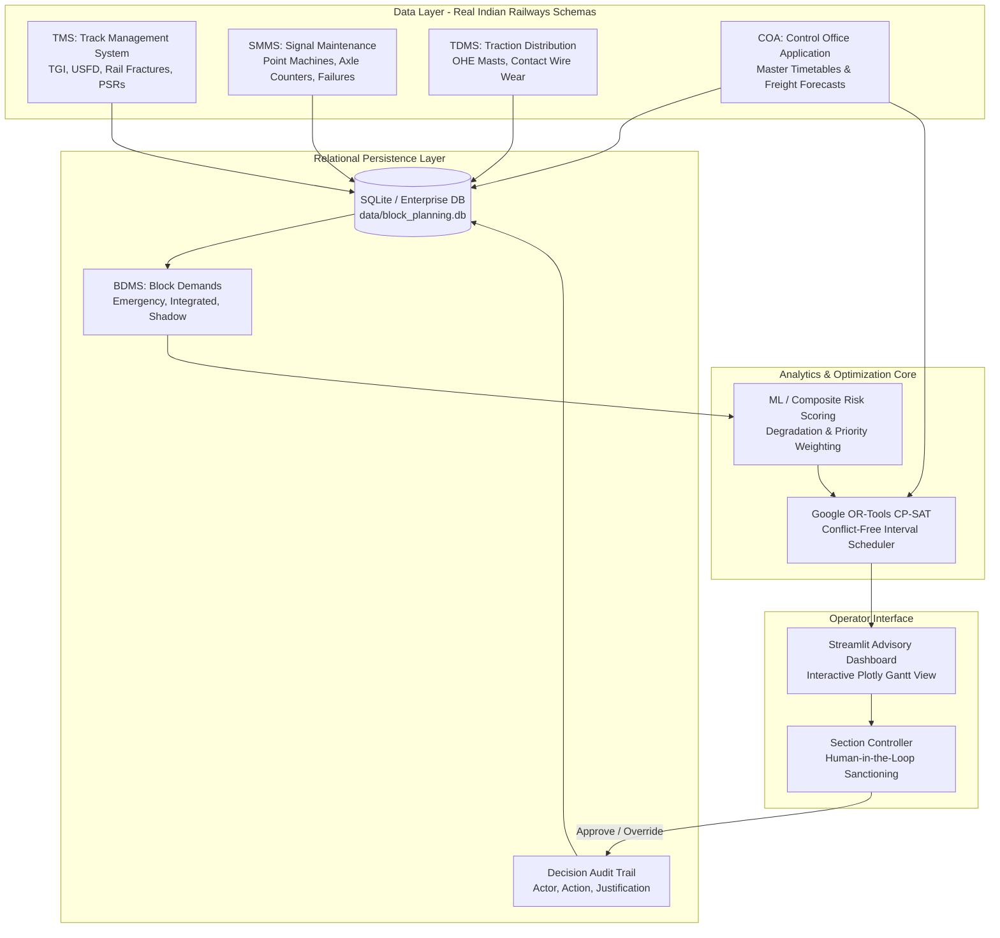

# SIH26027 System Architecture & Workflow

## 1. System Vision: Human-in-the-Loop Advisory Support

The **AI-Assisted Block Planning Decision-Support System (SIH26027)** is engineered as a high-precision, safety-critical decision-support tool for Indian Railways Section Controllers.

> [!IMPORTANT]
> **Core Framing**: The system does **not** unilaterally alter operational schedules or autonomously close track sections. Instead, it detects multi-departmental collisions across 100+ kilometers of corridor in milliseconds, prioritizes urgent maintenance based on composite infrastructure risk scores, and formulates an optimal conflict-free timetable proposal using Google OR-Tools CP-SAT constraint programming. The human Section Controller retains statutory sign-off by reviewing and clicking **Approve** or **Override**.

---

## 2. High-Level Architecture Diagram



---

## 3. Seeded Bottleneck Collision Scenario (Segment 35)

To evaluate conflict detection and optimization under realistic corridor stress, the system seeds a multi-departmental collision on **Segment 35 (Km 34.0–35.0)** on **Tuesday, Sep 8, 2026**:

```
09:00       09:30       10:00       10:30       11:00       11:30       12:00
  │           │           │           │           │           │           │
  ├───────────┼───────────┼───────────┼───────────┼───────────┼───────────┤
  │           │ [Coal Freight] (09:30-09:50)      │ [Howrah-Mumbai Mail] (11:15-11:25)
  │           │           │                       │           │
  │           │◄─────────── [BLK_TRD_CONFL: Shadow OHE Block] ────────►│
  │           │           │ (09:30 - 11:00)       │           │
  │           │           │                       │           │
  │           │           │◄─────────── [BLK_ENG_CONFL: Emergency] ──────────►│
  │           │           │             (10:00 - 12:00)       │
  │           │           │                       │           │
  │           │           │     ◄── [BLK_SNT_CONFL: Integrated] ──►
  │           │           │         (10:30 - 11:30)           │
```

### Conflicting Demands:
1. **Engineering (`BLK_ENG_CONFL`)**:
   - **Type**: Emergency block (10:00 - 12:00).
   - **Trigger**: Severe rail fracture detected at Km 34.4 (`TMS_DEF_035`).
   - **Constraint**: Mandatory closure; cannot be dropped or delayed beyond urgent window.
2. **Signal & Telecomm (`BLK_SNT_CONFL`)**:
   - **Type**: Integrated block (10:30 - 11:30).
   - **Trigger**: Switch lock failure on Point Machine PM-35 (`FAIL_SIG_035`).
3. **Traction (`BLK_TRD_CONFL`)**:
   - **Type**: Shadow block (09:30 - 11:00).
   - **Trigger**: Misaligned OHE mast cantilever at Km 34.6 (`TRD_DEF_035`).
4. **Traffic Timetable Collisions (`coa_timetable`)**:
   - **Train 12810 (Howrah - CSMT Mumbai Mail)**: Segment 35 scheduled occupation `11:15 - 11:25`.
   - **Cargo Train (Coal Freight BOXN-35)**: Segment 35 scheduled occupation `09:30 - 09:50`.

The constraint solver is designed to reschedule non-emergency demands (shifting or bundling compatible work into Shadow/Integrated windows) while strictly safeguarding passenger train corridors and enforcing the emergency rail fracture closure.

---

## 4. Regulatory Audit Logging

Every interaction with proposed blocks is logged to `decision_audit` with:
- **Audit ID**: Unique monotonic identifier.
- **Actor**: Specific railway operator ID (e.g., `Section Controller SC_01`).
- **Timestamp**: Precise ISO-8601 execution time.
- **Action**: `Approve`, `Reschedule`, `Override`, or `Reject`.
- **Reason**: Domain rationale for overriding or approving an automated recommendation.
